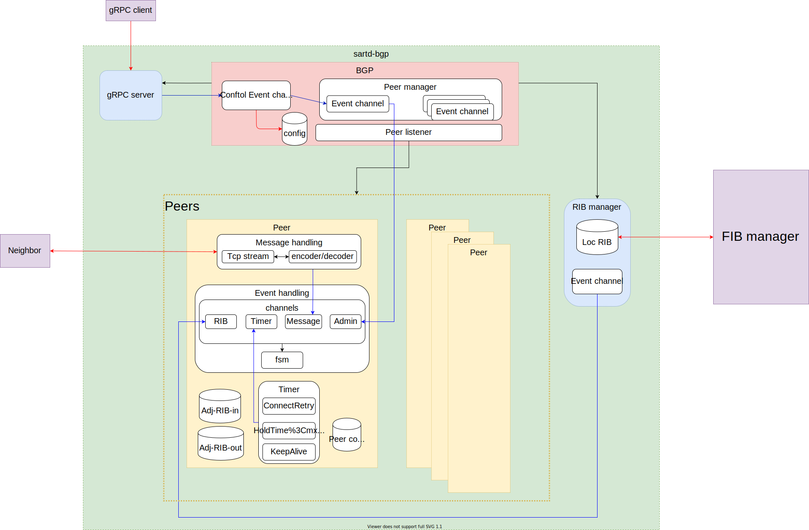

# Architecture of sartd-bgp




## BGP Finite State Machine

### State

1. Idle
2. Connect
3. Active
4. OpenSent
5. OpenConfirm
6. Established

### Event

#### Administrative Event

- ManualStart
  - 1
  - mandatory
- ManualStop
  - 2
  - mandatory
- AutomaticStart
  - 3
  - optional 
- ManualStart_with_PassiveTcpEstablishment
  - 4
  - optional 
- AutomaticStart_with_PassiveTcpEstablishment
  - 5
  - optional 
- AutomaticStart_with_DampPeerOscillations
  - 6
  - optional 
- AutomaticStart_with_DampPeerOscillations_and_PassiveTcpEstablishment
  - 7
  - optional 
- AutomaticStop
  - 8
  - optional 

#### Timer Event

- ConnectRetryTimer_Expires
  - 9
  - mandatory
- HoldTimer_Expires
  - 10
  - mandatory
- KeepaliveTimer_Expires
  - 11
  - mandatory
- DelayOpenTimer_Expires
  - 12
  - optional
- IdleHoldTimer_Expires
  - 13
  - optional

#### TCP Connection-Based Event

- TcpConnection_Valid
  - 14
  - mandatory
- Tcp_CR_Invalid
  - 15
  - optional 
- Tcp_CR_Acked
  - 16
  - mandatory
- TcpConnectionConfirmed
  - 17
  - mandatory
- TcpConnectionFails
  - 18
  - mandatory

#### BGP Message-Based Event

- BGPOpen
  - 19
  - mandatory
- BGPOpen with DelayOpenTimer running
  - 20 
  - optional 
- BGPHeaderErr
  - 21 
  - mandatory
- BGPOpenMsgErr
  - 22 
  - mandatory
- OpenCollisionDump
  - 23
  - optional 
- NotifMsgVerErr
  - 24
  - mandatory
- NotifMsg
  - 25 
  - mandatory
- KeepAliveMsg
  - 26
  - mandatory
- UpdateMsg
  - 27
  - mandatory
- UpdateMsgErr
  - 28
  - mandatory

### State Diagram

```marmaid
stateDiagram-v2
    Idle --> Connect: 1
    Idle --> Idle: others
    Connect --> Connect: 1,9,14
    Connect --> Active: 18
    Connect --> OpenSent: 16,17
    Connect --> Idle: others
    Active --> OpenSent: 16,17
    Active --> OpenConfrm: 19
    Active --> Connect: 9
    Active --> Active: 1,14
    Active --> Idle: others
    OpenSent --> OpenSent: 1,14,16,17
	OpenSent --> Active: 18
	OpenSent --> OpenConfirm: 19
    OpenSent --> Idle: others
	OpenConfirm --> OpenConfirm: 1,11,14,16,17
    OpenConfirm --> Established: 26
    OpenConfirm --> Idle: others
    Established --> Established: 1,11,26,27
    Established --> Idle: others
```

