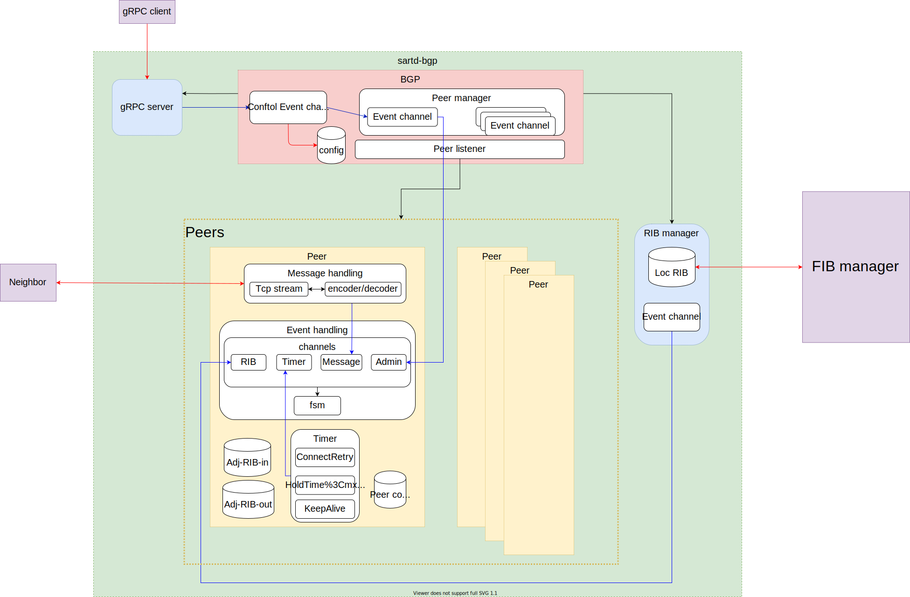
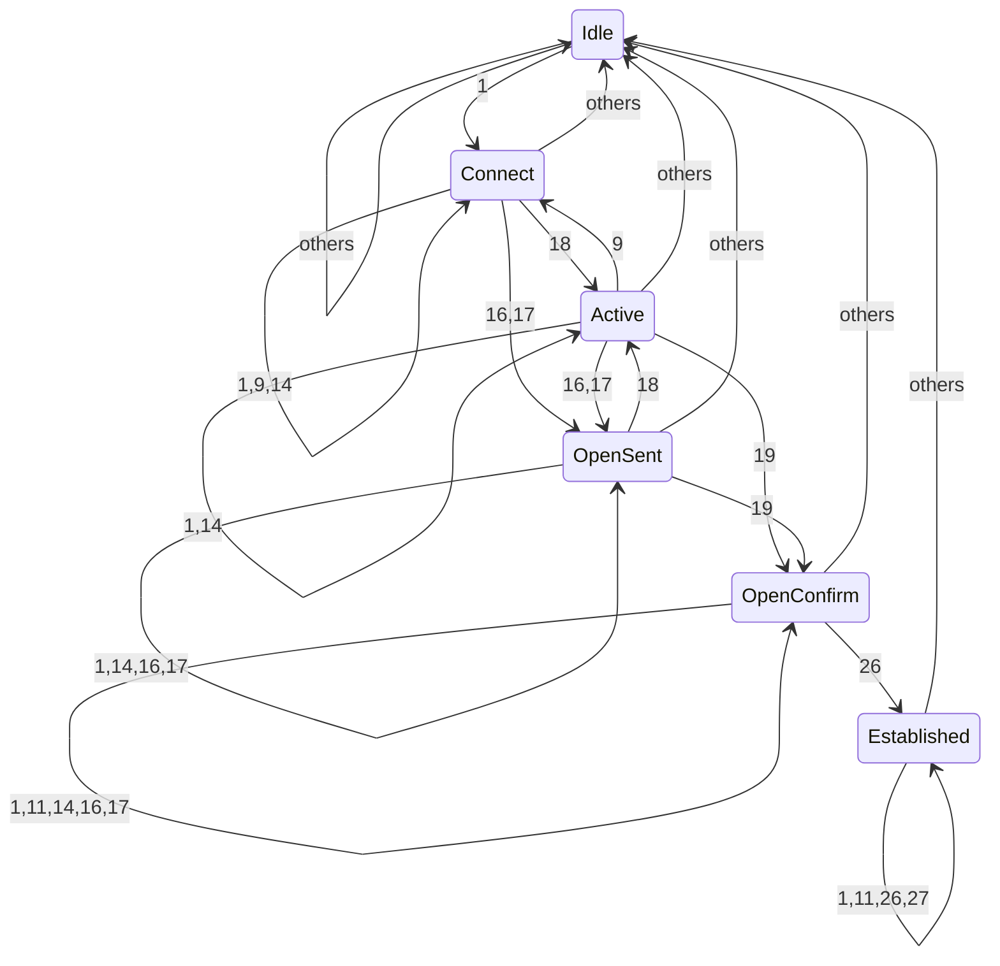
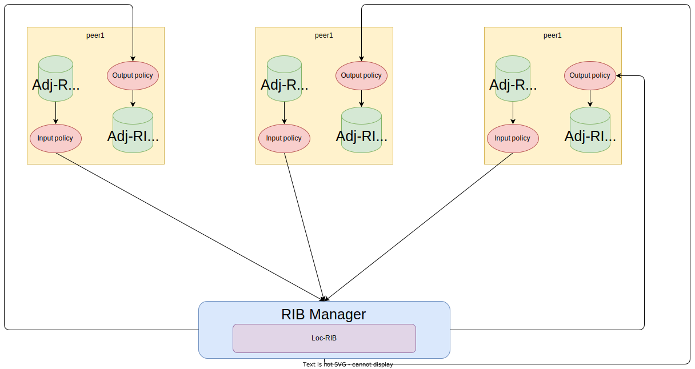

# Design of sart

## Overview

Sart is Kubernetes network load-balancer and CNI plugin for Kubernetes using BGP in Rust.
This project is inspired by [Metallb](https://github.com/metallb/metallb) and [Coil](https://github.com/cybozu-go/coil).

> [!WARNING]
> CNI feature is not implemented yet.

## Programs

Sart has following progarams.

- `sart`
  - CLI tool to control and describe `sartd`.
- `sartd`
  - Daemon program that has following features.
	- bgp: BGP daemon
	- fib: FIB daemon
	- agent: Kubernetes agent running as DaemonSet
	- controller: Kubernetes custom controller running as Deployment
- `sartcni`
  - TBD

## BGP

Sart's BGP feature(sartd-bgp) is based on [RFC 4271 - A Border Gateway Protocol 4 (BGP-4)](https://datatracker.ietf.org/doc/html/rfc4271).
And sartd-bgp is configurable via gRPC interface.

### Features

Sartd-bgp has following features.
Now sartd-bgp support minimal features to work as BGP speaker.

- [x] eBGP
- [x] iBGP
- [x] 4 Bytes ASN
- [ ] Policy injection
- [x] Multiple paths
- [ ] IPv6 features
- [ ] BGP unnumbered
- [ ] Route Reflector

### Archietecture

This figure shows a basic model of sartd-bgp.



Sartd-bgp is the event driven model.


#### Peer handling

A peer has one event handler to wait for given events.
And peer has channels to handle some events.
Events include the following.

- Message
- Timer
- Rib
- Admin

Once an event is generated, it is queued to the channel.
Then the event handler retrieves and processes its event.
After that, according to the result, it move the state of BGP FSM.

##### Finite State Machine

BGP has an independent FSM for each peer.
This diagram shows how BGP states move by given events.
Please refer [RFC 4271: Section 8.2.2](https://datatracker.ietf.org/doc/html/rfc4271#section-8.2.2) for details such as event numbers.



#### RIB(Routing Information Base)

This figure shows how sart-dbgp handle routing information.
RIB-Manager has the event handler and wait for RIB event from peers.

When Adj-RIB-In gets some paths, its peer filters by Input policies, and publishes the event to store into the Loc-RIB.
And Loc-RIB gets paths, Loc-RIB selects new best path and if the best path is changed, publishes the event to all peers.
If a peer receives its event from RIB-Manager, it filter paths by Output policies, and store into Adj-RIB-Out.



## FIB

TBD

## Kubernetes

Sart has Kubernetes network load-balancer feature.
This is named `sartd-kubernetes`.

Sartd-kubernetes is Kubernetes custom controller.

### Components

Sartd-kubernetes consists of following two components.

- `controller`
- `agent`

`controller` runs as `Deployment` to manage non node local resources such as `Service` and `EndpointSlice`.
And this also manages admission webhooks.
This is responsible to control load-balancer addresses.

`agent` runs as `DaemonSet` on each node to control node local resources.
This interact with the node local BGP speaker to announce load-balancer addresses to external networks.

### Custom Resource Definition

`Sartd-kubernetes` defines following custom resources.

- `AddressPool`
- `AddressBlock`
- `ClusterBGP`
- `NodeBGP`
- `BGPPeer`
- `BGPPeerTemplate`
- `BGPAdvertisement`

These CRD's API group and version is `sart.terassyi.net`, `v1alpha2`

#### AddressPool

`AddressPool` defines a CIDR usable in itself.
This has `type` parameter to specify for which this pool will be use.
This also has `allocType` parameter to choose a method to allocate.

```yaml
apiVersion: sart.terassyi.net/v1alpha2
kind: AddressPool
metadata:
  name: default-lb-pool
spec:
  cidr: 10.0.1.0/24
  type: service
  allocType: bit
  blockSize: 24
  autoAssign: true
```

#### AddressBlock

`AddressBlock` defines a subset of the `AddressPool` and its CIDR must be contained by AddressPool's CIDR.

This is automatically generated by `AddressPool`.

If the parent `AddressPool`'s type is `service`, `AddressPool` must be one for its pool.

```yaml
apiVersion: sart.terassyi.net/v1alpha2
kind: AddressBlock
metadata:
  name: non-default-lb-pool
spec:
  autoAssign: false
  cidr: 10.0.100.0/24
  nodeRef: null
  poolRef: non-default-lb-pool
  type: service
```

#### ClusterBGP

`ClusterBGP` defines a cluster wide BGP configurations.
We can select nodes to be configurable by `nodeSelector`.

This can template node local ASN and Router-Id settings.
And this also provide a way to template BGP peer settings.

```yaml
apiVersion: sart.terassyi.net/v1alpha2
kind: ClusterBGP
metadata:
  name: clusterbgp-sample-a
spec:
  nodeSelector:
    bgp: a
  asnSelector:
    from: label
  routerIdSelector:
    from: internalAddress
  speaker:
    path: 127.0.0.1:5000
  peers:
    - peerTemplateRef: bgppeertemplate-sample
      nodeBGPSelector:
        bgp: a
```

#### NodeBGP

`NodeBGP` defines a node local BGP configuration.

This is automatically generated by `ClusterBGP`.
This is managed by `agent`.

```yaml
apiVersion: sart.terassyi.net/v1alpha2
kind: NodeBGP
metadata:
  labels:
    bgp: a
  name: sart-worker
spec:
  asn: 65000
  peers:
  - name: bgppeertemplate-sample-sart-worker-65000-9.9.9.9
    ...
  routerId: 172.18.0.2
  speaker:
    path: 127.0.0.1:5000
```

#### BGPPeer

`BGPPeer` defines a local BGP peer abstraction.
This resource will be created by `NodeBGP` and we can also create manually.

This is manged by `agent`.

```yaml
apiVersion: sart.terassyi.net/v1alpha2
kind: BGPPeer
metadata:
  labels:
    bgp: a
    bgppeer.sart.terassyi.net/node: sart-worker
  name: bgppeer-sample-sart-worker
spec:
  addr: 9.9.9.9
  asn: 65000
  nodeBGPRef: sart-worker
  speaker:
    path: 127.0.0.1:5000
```

#### BGPPeerTemplate

`BGPPeerTemplate` defines a template BGP peer configuration.

```yaml
apiVersion: sart.terassyi.net/v1alpha2
kind: BGPPeerTemplate
metadata:
  name: bgppeertemplate-sample
spec:
  asn: 65000
  addr: 9.9.9.9
  groups:
    - to-router0
```

#### BGPAdvertisement

`BGPAdvertisement` defines a prefix announced by BGPPeers.
This is automatically generated when the `controller` allocates new addresses.

```yaml
apiVersion: sart.terassyi.net/v1alpha2
kind: BGPAdvertisement
metadata:
  labels:
    kubernetes.io/service-name: app-svc-cluster
  name: app-svc-cluster-hv4l5-10.0.1.0
  namespace: test
spec:
  attrs: null
  cidr: 10.0.1.0/32
  protocol: ipv4
  type: service
```

### IP Address Management(IPAM)

#### Service type LoadBalancer

`Sartd-kubernetes` has IPAM for Service type LoadBalancer.

##### AddressPool

To allocate IP addresses to LoadBalancer,

##### Choosing pools

##### Requesting specific addresses

##### AddressBlock

##### Allocating LoadBalancer addresses

### Announcing addresses

## CNI for Kubernetes
