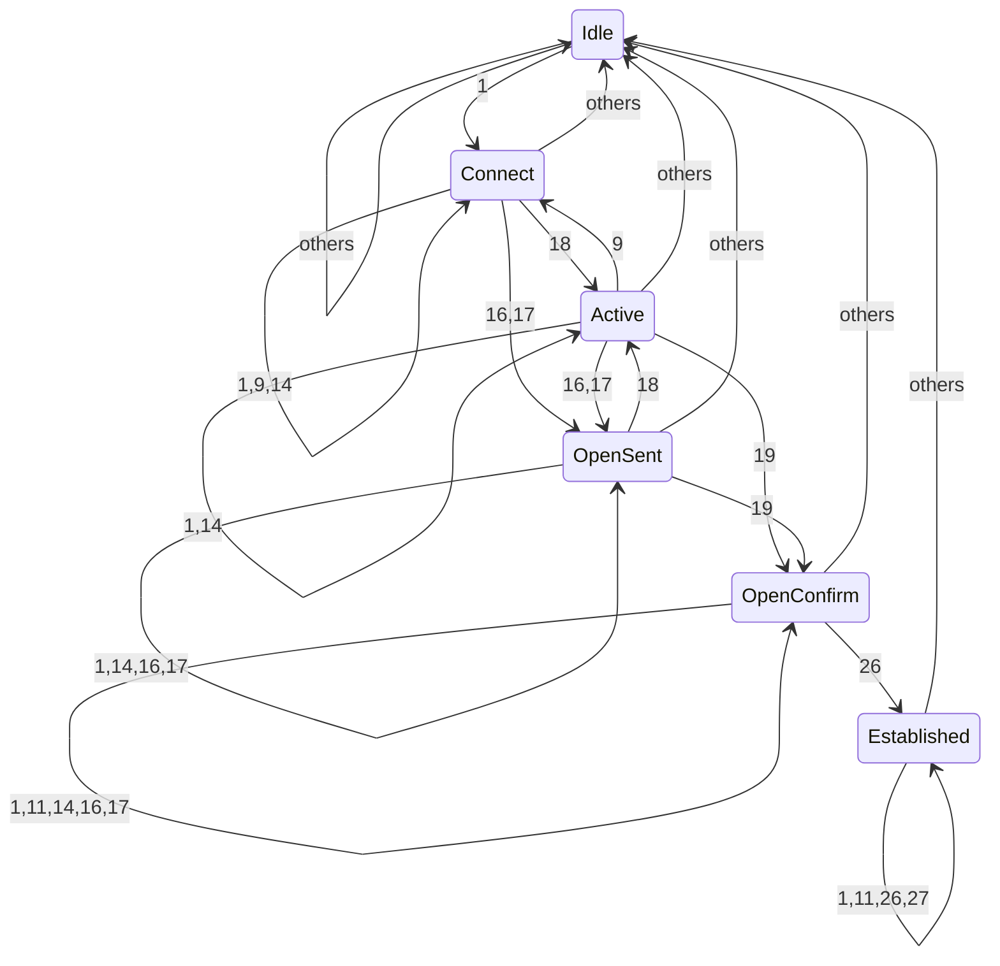
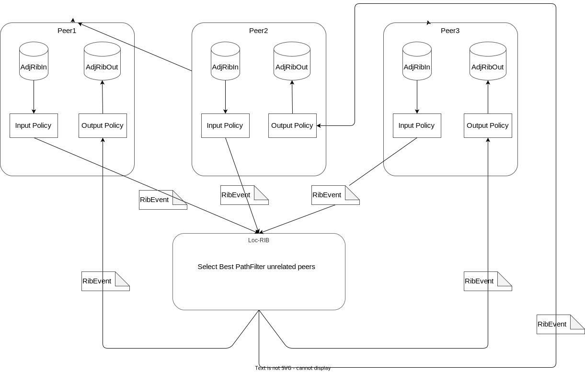

# Design of sartd

Sartd is a self made routing software.
This has some features described bellow.

- [x] BGP
- [x] Fib
- [ ] CNI

Sartd has gRPC and CLI interfaces to configure and to get information.

Sartd is implemented by Rust and [tokio](https://tokio.rs/) for a asynchronous runtime.

## BGP

Sartd-bgp is based on [RFC 4271 - A Border Gateway Protocol 4 (BGP-4)](https://datatracker.ietf.org/doc/html/rfc4271).
This is configurable by using CLI or gRPC API.

### Features

Now, sartd-bgp has only minimal features.

- [x] eBGP
- [x] iBGP
- [x] 4 Bytes ASN
- [ ] Policy injection
- [x] ECMP
- [ ] IPv6 features
- [ ] BGP unnumbered
- [ ] Route Reflector

### Peer handling model

This figure is a basic model of BGP peer.

#### BGP Finite State Machine

##### State

1. Idle
2. Connect
3. Active
4. OpenSent
5. OpenConfirm
6. Established

##### State Diagram

### rib handling model

This figure is a basic model of BGP RIB.

## Fib

Sartd-fib is the FIB(Forwarding Information Base) manager.
This component subscribes routes from some protocols and publishes to other protocols.

Now, we support kernel route tables and sartd-bgp for importer and exporter.
